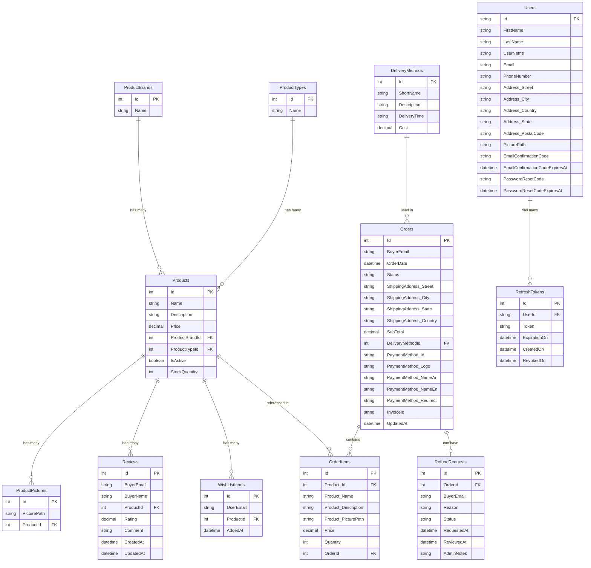

# 🛒 Talabat — E-Commerce REST API

A fully-featured e-commerce backend built with **ASP.NET 10 Web API**, following **Clean Architecture** principles. Includes product management, ordering, basket (Redis), authentication with JWT, reviews, wishlists, refunds, and more.

---

## 🏗️ Architecture

This project follows **Clean Architecture** combined with **CQRS**, separating concerns into distinct layers:

```
├── Talabat.APIs              → Presentation Layer
│   ├── Controllers, Middleware, Program.cs
│   └── Extensions
│
├── Talabat.Application       → Use Cases Layer (Use Cases)
│   ├── Account, Auth, Basket, Order, Products, Reviews, Wishlist
│   └── Extensions
│
├── Talabat.Domain            → Core Layer
│   ├── Models, Repositories, Services
│   ├── Shared, Specifications
│   └── (No dependency on any other layer)
│
└── Talabat.Infrastructure    → Infrastructure Layer
    ├── Data, DatabaseInitializer
    ├── Repositories, Services
    └── Extensions
```

### Key Architectural Patterns

- **Clean Architecture**: Separation of concerns with dependency inversion — outer layers depend on inner layers, never the reverse
- **CQRS (Command Query Responsibility Segregation)**: Separate models for read and write operations, keeping queries and commands isolated per module
- **Repository Pattern**: Abstracted data access layer with generic and specific repositories defined in `Talabat.Domain` and implemented in `Talabat.Infrastructure`
- **Specification Pattern**: Encapsulated query logic in `Talabat.Domain/Specifications` for flexible and reusable filtering
- **Unit of Work**: Coordinates multiple repository operations within a single transaction

---

## ⚙️ Tech Stack

| Layer | Technology |
|---|---|
| Framework | ASP.NET 10 Web API |
| ORM | Entity Framework Core |
| Database | SQL Server |
| Caching / Basket | Redis (Redis Cloud) |
| Authentication | ASP.NET Identity + JWT + Refresh Tokens |
| Payment Gateway |	Fawaterak |
| Logging | Serilog (Console + File sinks) |
| API Docs | Swagger / APIDog |
| Hosting | Monster ASP.NET Hosting |

---

## 🗄️ Database Schema

The system uses two database contexts — one for the store data and one for ASP.NET Identity.



### Entity Relationships

- **ProductBrands / ProductTypes → Products**: One-to-Many (products belong to a brand and type)
- **Products → ProductPictures**: One-to-Many (a product can have multiple pictures)
- **Products → Reviews**: One-to-Many (a product can have many customer reviews)
- **Products → WishListItems**: One-to-Many (a product can be wishlisted by many users)
- **Orders → OrderItems**: One-to-Many (an order contains multiple line items)
- **Orders → RefundRequests**: One-to-One (an order can have one refund request)
- **DeliveryMethods → Orders**: One-to-Many (a delivery method can be used in many orders)
- **Users → RefreshTokens**: One-to-Many (a user can have multiple active refresh tokens)

---

## 🔐 Authentication Flow

- Register → Email Confirmation → Login → JWT Access Token + Refresh Token
- Access tokens are short-lived; refresh tokens allow silent re-authentication
- Refresh tokens can be explicitly revoked
- Password reset via email token

---

## 💳 Payment Integration

This project integrates with **[Fawaterak](https://fawaterk.com)** — an Egyptian payment gateway that supports multiple payment methods including credit cards, Fawry, Vodafone Cash, and more.

Payment is initiated when an order is created. The API calls Fawaterak to generate a payment invoice and returns a redirect URL for the customer to complete the payment. The `Fawaterak` config section in `appsettings.json` holds the `BaseUrl`, `ApiKey`, and `ProviderKey` required for the integration.

### Webhook Setup (Required for local development)

Fawaterak communicates payment results back to your API via webhooks. Since localhost is not publicly accessible, you need to expose your local server using **[ngrok](https://ngrok.com/download)**.

**1. Install and run ngrok:**
```bash
ngrok http 5172
```
This gives you a public HTTPS URL like `https://xxxx-xxxx.ngrok-free.app`.

**2. Configure webhooks in the Fawaterak dashboard:**

Go to [https://staging.fawaterk.com/vendor/integration](https://staging.fawaterk.com/vendor/integration) and fill in the following fields using your ngrok URL:

| Field | Value |
|---|---|
| IFRAME Domains | `https://your-ngrok-url.ngrok-free.app` |
| Paid transactions webhook | `https://your-ngrok-url.ngrok-free.app/api/orders/webhook/paid_json` |
| Cancellation webhook | `https://your-ngrok-url.ngrok-free.app/api/orders/webhook/cancel` |
| Failed transactions webhook | `https://your-ngrok-url.ngrok-free.app/api/orders/webhook/failed` |
| Refund transactions webhook | `https://your-ngrok-url.ngrok-free.app/api/orders/webhook/refund` |

---

## 📡 API Endpoints
 
Full interactive docs: [APIDog Documentation](https://share.apidog.com/847b706a-e07a-4d5a-94b8-c6d6d2c9242a)

### 🔑 Auth
| Method | Endpoint | Description |
|---|---|---|
| POST | `/api/auth/register` | Register a new user |
| POST | `/api/auth/confirm-email` | Confirm email address |
| POST | `/api/auth/resend-confirmation-email` | Resend confirmation email |
| POST | `/api/auth/login` | Login and receive tokens |
| POST | `/api/auth/forget-password` | Request password reset |
| POST | `/api/auth/reset-password` | Reset password with token |
| POST | `/api/auth/refresh-token` | Refresh access token |
| POST | `/api/auth/revoke-refresh-token` | Revoke refresh token |

### 👤 Account
| Method | Endpoint | Description |
|---|---|---|
| GET | `/api/account` | Get current user profile |
| GET | `/api/admin/account/users` | Get all users (Admin) |
| PUT | `/api/account` | Update user profile |
| DELETE | `/api/account` | Delete user account |
| PUT | `/api/account/change-password` | Change password |
| POST | `/api/account/picture` | Upload profile picture |
| DELETE | `/api/account/picture` | Delete profile picture |
| POST | `/api/admin/account/role` | Add user to role (Admin) |
| DELETE | `/api/admin/account/role` | Remove user from role (Admin) |

### 📦 Products
| Method | Endpoint | Description |
|---|---|---|
| GET | `/api/products/types` | Get all product types |
| GET | `/api/products/brands` | Get all product brands |
| GET | `/api/products` | Get all products (supports filtering/paging) |
| GET | `/api/products/{id}` | Get a single product |
| POST | `/api/admin/products` | Add a product (Admin) |
| PUT | `/api/admin/products/{id}` | Update a product (Admin) |
| DELETE | `/api/admin/products/{id}` | Delete a product (Admin) |
| POST | `/api/admin/products/{id}/pictures` | Upload product picture (Admin) |
| DELETE | `/api/admin/products/{id}/pictures` | Delete product picture (Admin) |

### ⭐ Reviews
| Method | Endpoint | Description |
|---|---|---|
| GET | `/api/products/{id}/reviews` | Get all reviews for a product |
| GET | `/api/products/{id}/reviews/{reviewId}` | Get a single review |
| POST | `/api/products/{id}/reviews` | Add a review (Authenticated) |
| PUT | `/api/products/{id}/reviews/{reviewId}` | Update own review |
| DELETE | `/api/products/{id}/reviews/{reviewId}` | Delete own review |
| DELETE | `/api/admin/products/{id}/reviews/{reviewId}` | Admin delete any review |

### ❤️ Wishlist
| Method | Endpoint | Description |
|---|---|---|
| GET | `/api/wishlist` | Get current user's wishlist |
| POST | `/api/wishlist` | Add product to wishlist |
| DELETE | `/api/wishlist/{productId}` | Remove product from wishlist |

### 🧺 Basket
| Method | Endpoint | Description |
|---|---|---|
| GET | `/api/basket/{id}` | Get customer basket |
| POST | `/api/basket` | Create or update basket |
| DELETE | `/api/basket/{id}` | Delete basket |

> Basket is stored in **Redis** and is session-based (no authentication required).

### 📋 Orders
| Method | Endpoint | Description |
|---|---|---|
| GET | `/api/orders` | Get current user's orders |
| GET | `/api/orders/{id}` | Get order by ID |
| POST | `/api/orders` | Create a new order |
| GET | `/api/admin/orders` | Get all orders (Admin) |
| PUT | `/api/admin/orders/{id}/status` | Update order status manually (Admin) |
| GET | `/api/orders/{id}/invoice` | Get invoice details |
| GET | `/api/orders/delivery-methods` | Get available delivery methods |
| GET | `/api/orders/payment-methods` | Get available payment methods |

### 🔄 Refunds
| Method | Endpoint | Description |
|---|---|---|
| POST | `/api/orders/{id}/refund` | Submit a refund request |
| GET | `/api/orders/{id}/refund` | Get own refund request |
| GET | `/api/admin/orders/refunds` | Get all refund requests (Admin) |
| GET | `/api/admin/orders/refunds/{id}` | Get single refund request (Admin) |
| POST | `/api/admin/orders/refunds/{id}/reject` | Reject a refund request (Admin) |

---

## 🚀 Getting Started

### Prerequisites
- [.NET 10 SDK](https://dotnet.microsoft.com/download)
- SQL Serve
- Redis instance ([Redis Cloud free tier](https://redis.io/try-free) recommended)

### 1. Clone the repository
```bash
git clone https://github.com/your-username/talabat-api.git
```

### 2. Configure settings

Add the following configuration to your `appsettings.json` and fill in your values:

```json
{
  "JwtOptions": {
    "SecretKey": "your-secret-key",
    "Issuer": "your-issuer",
    "Audience": "your-audience",
    "ExpirationInMinutes": 60,
    "ExpirationInDays": 1
  },
  "EmailSettings": {
    "SenderEmail": "your-email@gmail.com",
    "Password": "your-app-password",
    "DisplayName": "Talabat",
    "Host": "smtp.gmail.com",
    "Port": 587
  },
  "Fawaterak": {
    "BaseUrl": "https://staging.fawaterk.com/api/v2",
    "ApiKey": "your-fawaterak-api-key",
    "ProviderKey": "your-provider-key"
  },
  "ConnectionStrings": {
    "DefaultConnection": "#{DB_CONNECTION_STRING}#"
  },
  "RedisConnection": "#{REDIS_CONNECTION_STRING}#"
}
```

> ⚠️ **Never commit real credentials to source control.** Use environment variables or a secrets manager for sensitive values.

### 3. Run the API

> ✅ **No need to apply migrations manually.** The application automatically applies any pending migrations on startup.

```bash
dotnet run --project Talabat.APIs
```

The API will be available at `http://localhost:5172`.  
Swagger UI: `http://localhost:5172/swagger`

---

## 📁 Logging

Logs are written using **Serilog**:
- **Development**: Console (colored, human-readable) + rolling JSON file under `Logs/`
- **Production**: Rolling JSON file under `/var/log/talabat/` with 30-day retention

---
